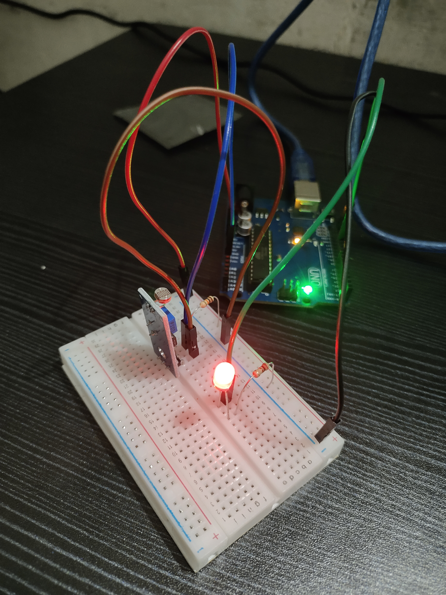
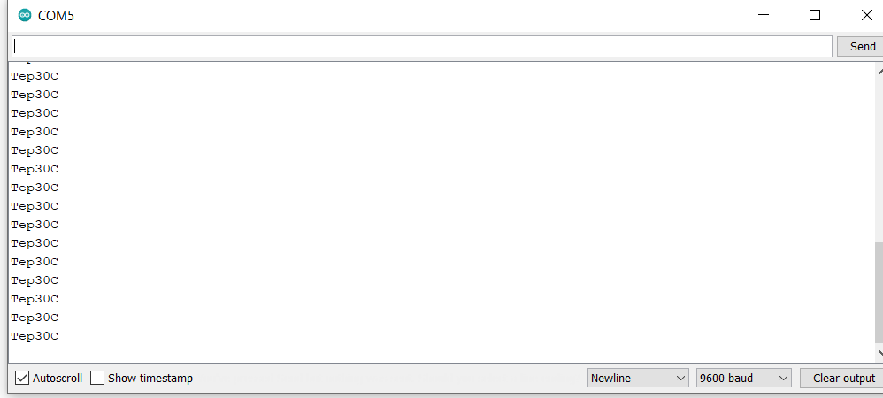
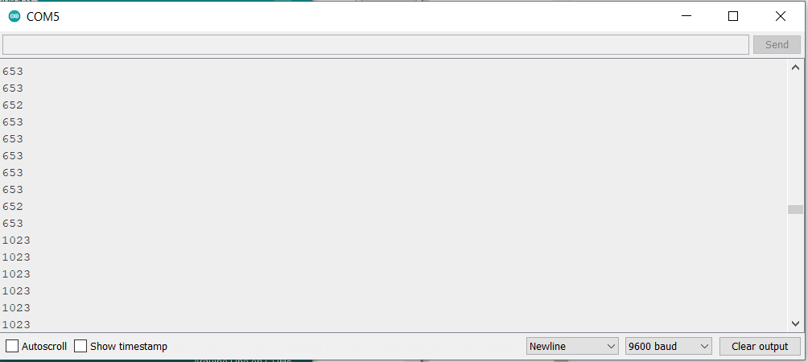
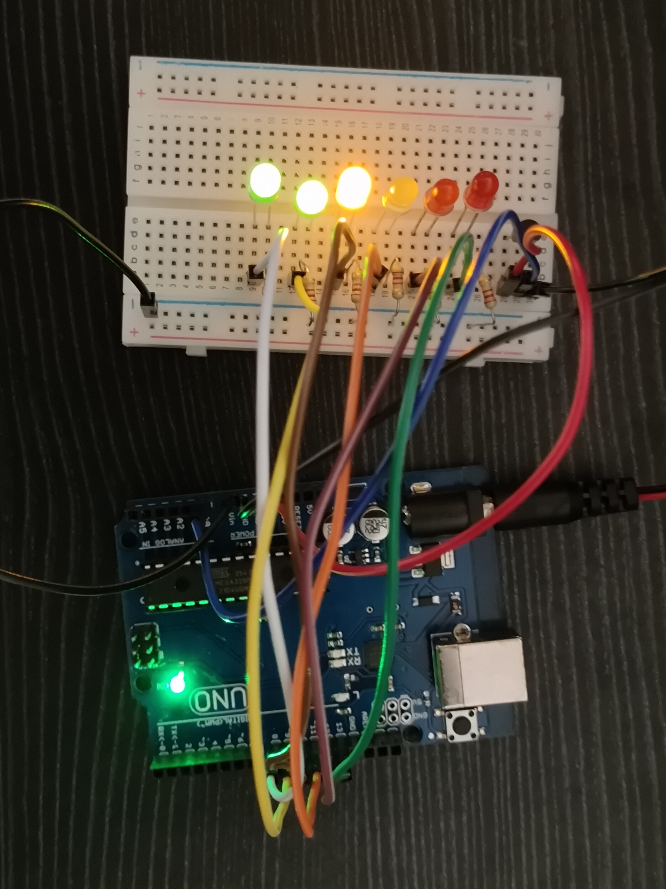

Hi, I'm Adil S. I'm a 2nd-year Computer Science Engineering student at Government Engineering College Idukki. It's my first attempt at IoT. Hope it goes well

# Experiments

## Exp 1 : Hello World LED Blinking

### Components Required:
   * Arduino Uno Board x1
   * USB Cable x1
   * LED (Any Color) x1
   * 220 OHM Resistor X1
   * Breadboard
   * Jumper Wires (Male to Male ) x2

### Code
    int ledPin = 10; // define digital pin 10.
    void setup(){
     pinMode(ledPin, OUTPUT);// define pin with LED connected as output.
    }
    void loop()
    {
     digitalWrite(ledPin, HIGH); // set the LED on.
     delay(1000); // wait for a second.
     digitalWrite(ledPin, LOW); // set the LED off.
     delay(1000); // wait for a second
    }

### Video
<iframe width="560" height="315" src="src/blink.mp4" title="YouTube video player" frameborder="0" allow="accelerometer; autoplay; clipboard-write; encrypted-media; gyroscope; picture-in-picture" allowfullscreen></iframe>

___

## Exp 2 : Traffic Light

### Components Required:
  * Arduino board x1
  * USB cable x1
  * Red M5 LED x1
  * Yellow M5 LED x1
  * Green M5 LED x1
  * 220Ω resistor x3
  * Breadboard x1
  * Breadboard jumper wires as needed

### Code
    int red =10; // initialize digital pin 8.
    int yellow =7; // initialize digital pin 7.
    int green =4; // initialize digital pin 4.
    void setup(){
     pinMode(red, OUTPUT);// set the pin with red LED as “output”
     pinMode(yellow, OUTPUT); // set the pin with yellow LED as “output”
     pinMode(green, OUTPUT); // set the pin with green LED as “output”
    }
    void loop(){
     digitalWrite(green, HIGH);//// turn on green LED
     delay(5000);// wait 5 seconds
     digitalWrite(green, LOW); // turn off green LED
     for(int i=0;i<3;i++){// blinks for 3 times
      delay(500);// wait 0.5 second
      digitalWrite(yellow, HIGH);// turn on yellow LED
      delay(500);// wait 0.5 second
      digitalWrite(yellow, LOW);// turn off yellow LED
     } 
     delay(500);// wait 0.5 second
     digitalWrite(red, HIGH);// turn on red LED
     delay(5000);// wait 5 seconds
     digitalWrite(red, LOW);// turn off red LED
    }

### Video
<iframe width="560" height="315" src="src/Traffic.mp4" title="YouTube video player" frameborder="0" allow="accelerometer; autoplay; clipboard-write; encrypted-media; gyroscope; picture-in-picture" allowfullscreen></iframe>

___

## Exp 3 : LED Chasing Effect

### Components Required:
  * LED x6
  * Arduino board x1
  * 220Ω resistor x6
  * Breadboard x1
  * USB cable x1
  * Breadboard wire x13

### Code
    int first= 2;  // the I/O pin for the first LED
    int last= 6;   // number of LEDs
    void setup(){
     for (int i = start; i < first + last; i ++){
      pinMode(i, OUTPUT);   // set I/O pins as output
     }
    }
    void loop(){
     for (int i = BASE; i < start +; i ++){
      digitalWrite(i, LOW);    // set I/O pins as “low”, turn off LEDs one by one.
      delay(200);        // delay
    }
     for (int i = BASE; i < BASE + NUM; i ++){
      digitalWrite(i, HIGH);    // set I/O pins as “high”, turn on LEDs one by one
      delay(200);        // delay
     }  
    }
    
    
### Video
<iframe width="560" height="315" src="src/chaser.mp4" title="YouTube video player" frameborder="0" allow="accelerometer; autoplay; clipboard-write; encrypted-media; gyroscope; picture-in-picture" allowfullscreen></iframe>
    
___

## Exp 4: Button Controlled LED

### Components Required:
  * Arduino Uno
  * Button switch x1
  * Red M5 LED x1
  * 220ΩResistor x1
  * 10KΩ Resistor x1
  * Breadboard x1
  * Breadboard Jumper Wire x6
  * USB cable x1

### Code
    int ledpin=11;// initialize pin 11
    int inpin=7;// initialize pin 7
    int val;// define val
    void setup()
    {
    pinMode(ledpin,OUTPUT);// set LED pin as “output”
    pinMode(inpin,INPUT);// set button pin as “input”
    }
    void loop()
    {
    val=digitalRead(inpin);// read the level value of pin 7 and assign if to val
    if(val==LOW)// check if the button is pressed, if yes, turn on the LED
    { digitalWrite(ledpin,LOW);}
    else
    { digitalWrite(ledpin,HIGH);}
    }
    
    
    
### Video
<iframe width="560" height="315" src="src/push_button.mp4" title="YouTube video player" frameborder="0" allow="accelerometer; autoplay; clipboard-write; encrypted-media; gyroscope; picture-in-picture" allowfullscreen></iframe>
    
___

## Exp 5 : Buzzer

### Components Required:

  * Arduino Uno
  * Buzzer x1
  * Breadboard x1
  * Breadboard Jumper Wire x2
  * USB cable x1

### Code

    int buzzer=8;// initialize digital IO pin that controls the buzzer
    void setup() 
    { 
      pinMode(buzzer,OUTPUT);// set pin mode as “output”
    } 
    void loop() 
    {
    digitalWrite(buzzer, HIGH); // produce sound
    }
    
    
### Video
<iframe width="560" height="315" src="src/buzzer.mp4" title="YouTube video player" frameborder="0" allow="accelerometer; autoplay; clipboard-write; encrypted-media; gyroscope; picture-in-picture" allowfullscreen></iframe>
    
___

## Exp 6 : RGB LED

### Components Required:

  * Arduino Uno
  * USB Cable x1
  * RGB LED x1
  * Resistor x3
  * Breadboard jumper wire x5

### Code

    int redpin = 11; //select the pin for the red LED
    int bluepin =10; // select the pin for the blue LED
    int greenpin =9;// select the pin for the green LED
    int val;
    void setup() {
      pinMode(redpin, OUTPUT);
      pinMode(bluepin, OUTPUT);
      pinMode(greenpin, OUTPUT);
      Serial.begin(9600);
    }
    void loop() 
    {
    for(val=255; val>0; val--)
      {
       analogWrite(11, val);
       analogWrite(10, 255-val);
       analogWrite(9, 128-val);
       delay(1); 
      }
    for(val=0; val<255; val++)
      {
       analogWrite(11, val);
       analogWrite(10, 255-val);
       analogWrite(9, 128-val);
       delay(1); 
      }
     Serial.println(val, DEC);
    }

### Video
<iframe width="560" height="315" src="src/RGB.mp4" title="YouTube video player" frameborder="0" allow="accelerometer; autoplay; clipboard-write; encrypted-media; gyroscope; picture-in-picture" allowfullscreen></iframe>
    
___

## Exp 7 : LDR Light Sensor

### Components Required:

  * Arduino Uno Board
  * Photo Resistor x1
  * Red M5 LED x1
  * 10KΩ Resistor x1
  * 220Ω Resistor x1
  * Breadboard x1
  * Breadboard Jumper Wire x5
  * USB cable x1

### Code

    int potpin=0;// initialize analog pin 0, connected with photovaristor
    int ledpin=11;// initialize digital pin 11, 
    int val=0;// initialize variable val
    void setup()
    {
    pinMode(ledpin,OUTPUT);// set digital pin 11 as “output”
    Serial.begin(9600);// set baud rate at “9600”
    }
    void loop()
    {
    val=analogRead(potpin);// read the value of the sensor and assign it to val
    Serial.println(val);// display the value of val
    analogWrite(ledpin,val/4);// set up brightness（maximum value 255）
    delay(10);// wait for 0.01 
    }
    
    
### Image

    
___

## Extras on LDR

### Components Required:

  * Arduino Uno
  * Active buzzer
  * Breadboard Jumper Wire x5
  * LDR x1
  * LED x1
  * 10k and 220 ohms resistors

### Code

    //set pin numbers
    const int ledPin = 13;
    const int buzzerPin = 12;
    const int ldrPin = A0;
    void setup () {
      Serial.begin(9600);
      pinMode(ledPin, OUTPUT);
      pinMode(buzzerPin, OUTPUT);
      pinMode(ldrPin, INPUT);
    }
    void loop() {
      int ldrStatus = analogRead(ldrPin);  //read the state of the LDR value
      if (ldrStatus >= 400) {
        tone(buzzerPin, 100);
        digitalWrite(ledPin, HIGH);
        delay(100);
        noTone(buzzerPin);
        digitalWrite(ledPin, LOW);
        delay(100);
        Serial.println("----------- ALARM ACTIVATED -----------"); 
      }
      else {
        noTone(buzzerPin);
        digitalWrite(ledPin, LOW);
        Serial.println("ALARM DEACTIVATED");
      }
    }

### Video
<iframe width="560" height="315" src="src/ldr.mp4" title="YouTube video player" frameborder="0" allow="accelerometer; autoplay; clipboard-write; encrypted-media; gyroscope; picture-in-picture" allowfullscreen></iframe>
    
___

## Exp 8 : Flame Sensor

### Components Required:

  * Arduino Uno
  * Flame Sensor x1
  * Buzzer x1
  * 10K Resistor x1
  * Breadboard Jumper Wire x6
  * USB cable x1

### Code

    int flame=0;// select analog pin 0 for the sensor
    int Beep=9;// select digital pin 9 for the buzzer
    int val=0;// initialize variable
     void setup() 
    {
      pinMode(Beep,OUTPUT);// set LED pin as “output”
     pinMode(flame,INPUT);// set buzzer pin as “input”
     Serial.begin(9600);// set baud rate at “9600”
     } 
    void loop() 
    { 
      val=analogRead(flame);// read the analog value of the sensor 
      Serial.println(val);// output and display the analog value
      if(val>=600)// when the analog value is larger than 600, the buzzer will buzz
      {  
       digitalWrite(Beep,HIGH); 
       }else 
       {  
         digitalWrite(Beep,LOW); 
        }
       delay(500); 
    }
    
    
### Video
<iframe width="560" height="315" src="src/flame.mp4" title="YouTube video player" frameborder="0" allow="accelerometer; autoplay; clipboard-write; encrypted-media; gyroscope; picture-in-picture" allowfullscreen></iframe>
    
___

## Extras on Flame sensor

### Components Required:

  * Arduino Uno
  * Active buzzer
  * Breadboard Jumper Wire x5
  * Flame Sensor x1
  * Red LED x1
  * Green LED x1
  * 10k ohms resistor x1
  * 220 ohms resistor x2

### Code

    //Arduino Flame Sensor
    const int buzzerPin = 12;
    const int flamePin = 11;
    int Flame = HIGH;
    int redled = 5;
    int greenled = 6;
    void setup() 
    {
      pinMode(buzzerPin, OUTPUT);
      pinMode(redled, OUTPUT);
      pinMode(greenled, OUTPUT);

      pinMode(flamePin, INPUT);
      Serial.begin(9600);
    }

    void loop() 
    {
      Flame = digitalRead(flamePin);
      if (Flame== LOW)
      {
        digitalWrite(buzzerPin, HIGH);
        digitalWrite(redled, HIGH);
        digitalWrite(greenled, LOW);
      }
      else
      {
        digitalWrite(buzzerPin, LOW);
        digitalWrite(greenled, HIGH);
        digitalWrite(redled, LOW);
      }
    }

### Video
<iframe width="560" height="315" src="src/flame1.mp4" title="YouTube video player" frameborder="0" allow="accelerometer; autoplay; clipboard-write; encrypted-media; gyroscope; picture-in-picture" allowfullscreen></iframe>
    
___

## Exp 9 : LM35 Temperature Sensor

### Components Required:

  * Arduino Uno
  * LM35 x1
  * Breadboard x1
  * Breadboard Jumper Wire x5
  * USB cable

### Code

    int potPin = 0; // initialize analog pin 0 for LM35 temperature sensor
    void setup()
    {
    Serial.begin(9600);// set baud rate at”9600”
    }
    void loop()
    {
    int val;// define variable
    int dat;// define variable
    val=analogRead(0);// read the analog value of the sensor and assign it to val
    dat=(125*val)>>8;// temperature calculation formula
    Serial.print("Tep");// output and display characters beginning with Tep
    Serial.print(dat);// output and display value of dat
    Serial.println("C");// display “C” characters
    delay(500);// wait for 0.5 second
    }

### Image

    
___

## Exp 11 : Potentiometer analog Value Reading

### Components Required:

  * Arduino Uno
  * 10K Potentiometer x1
  * Breadboard x1
  * Breadboard Jumper Wire x3
  * USB cable x1

### Code

    int potpin=0;// initialize analog pin 0
    int ledpin=13;// initialize digital pin 13
    int val=0;// define val, assign initial value 0
    void setup()
    {
    pinMode(ledpin,OUTPUT);// set digital pin as “output”
    Serial.begin(9600);// set baud rate at 9600
    }
    void loop()
    {
    digitalWrite(ledpin,HIGH);// turn on the LED on pin 13
    delay(50);// wait for 0.05 second
    digitalWrite(ledpin,LOW);// turn off the LED on pin 13
    delay(50);// wait for 0.05 second
    val=analogRead(potpin);// read the analog value of analog pin 0, and assign it to val 
    Serial.println(val);// display val’s value
    }
    
### Image

    
___

## Extras on Potentiometer

### Components Required:

  * Arduino Uno
  * 10K Potentiometer x1
  * Breadboard x1
  * Breadboard Jumper Wire x3
  * USB cable x1
  * 1k ohms resistor x1
  * LED x1

### Code

    const int analog_ip = A0;
    const int LED = 3;
    int inputVal = 0;

    void setup() {
      pinMode (LED, OUTPUT);
    }

    void loop() {
      inputVal = analogRead(analog_ip);
      analogWrite (LED, inputVal/4);
      delay(100);
    }
    
    
### Video
<iframe width="560" height="315" src="src/pot.mp4" title="YouTube video player" frameborder="0" allow="accelerometer; autoplay; clipboard-write; encrypted-media; gyroscope; picture-in-picture" allowfullscreen></iframe>
    
___

## Exp 12 : 7 Segment Display

### Components Required:

  * Arduino Uno
  * 1-digit LED Segment Display x1
  * 220Ω Resistor x8
  * Breadboard x1
  * Breadboard Jumper Wires x several
  * USB cable x1

### Code

    int a=7;// set digital pin 7 for segment a
    int b=6;// set digital pin 6 for segment b
    int c=5;// set digital pin 5 for segment c
    int d=10;// set digital pin 10 for segment d
    int e=11;// set digital pin 11 for segment e
    int f=8;// set digital pin 8 for segment f
    int g=9;// set digital pin 9 for segment g
    int dp=4;// set digital pin 4 for segment dp
    void digital_0(void) // display number 5
    {
    unsigned char j;
    digitalWrite(a,HIGH);
    digitalWrite(b,HIGH);
    digitalWrite(c,HIGH);
    digitalWrite(d,HIGH);
    digitalWrite(e,HIGH);
    digitalWrite(f,HIGH);
    digitalWrite(g,LOW);
    digitalWrite(dp,LOW);
    }
    void digital_1(void) // display number 1
    {
    unsigned char j;
    digitalWrite(c,HIGH);// set level as “high” for pin 5, turn on segment c
    digitalWrite(b,HIGH);// turn on segment b
    for(j=7;j<=11;j++)// turn off other segments
    digitalWrite(j,LOW);
    digitalWrite(dp,LOW);// turn off segment dp
    }
    void digital_2(void) // display number 2
    {
    unsigned char j;
    digitalWrite(b,HIGH);
    digitalWrite(a,HIGH);
    for(j=9;j<=11;j++)
    digitalWrite(j,HIGH);
    digitalWrite(dp,LOW);
    digitalWrite(c,LOW);
    digitalWrite(f,LOW);
    }
    void digital_3(void) // display number 3
    {digitalWrite(g,HIGH);
    digitalWrite(a,HIGH);
    digitalWrite(b,HIGH);
    digitalWrite(c,HIGH);
    digitalWrite(d,HIGH);
    digitalWrite(dp,LOW);
    digitalWrite(f,LOW);
    digitalWrite(e,LOW);
    }
    void digital_4(void) // display number 4
    {digitalWrite(c,HIGH);
    digitalWrite(b,HIGH);
    digitalWrite(f,HIGH);
    digitalWrite(g,HIGH);
    digitalWrite(dp,LOW);
    digitalWrite(a,LOW);
    digitalWrite(e,LOW);
    digitalWrite(d,LOW);
    }
    void digital_5(void) // display number 5
    {
    unsigned char j;
    digitalWrite(a,HIGH);
    digitalWrite(b, LOW);
    digitalWrite(c,HIGH);
    digitalWrite(d,HIGH);
    digitalWrite(e, LOW);
    digitalWrite(f,HIGH);
    digitalWrite(g,HIGH);
    digitalWrite(dp,LOW);
    }
    void digital_6(void) // display number 6
    {
    unsigned char j;
    for(j=7;j<=11;j++)
    digitalWrite(j,HIGH);
    digitalWrite(c,HIGH);
    digitalWrite(dp,LOW);
    digitalWrite(b,LOW);
    }
    void digital_7(void) // display number 7
    {
    unsigned char j;
    for(j=5;j<=7;j++)
    digitalWrite(j,HIGH);
    digitalWrite(dp,LOW);
    for(j=8;j<=11;j++)
    digitalWrite(j,LOW);
    }
    void digital_8(void) // display number 8
    {
    unsigned char j;
    for(j=5;j<=11;j++)
    digitalWrite(j,HIGH);
    digitalWrite(dp,LOW);
    }
    void digital_9(void) // display number 5
    {
    unsigned char j;
    digitalWrite(a,HIGH);
    digitalWrite(b,HIGH);
    digitalWrite(c,HIGH);
    digitalWrite(d,HIGH);
    digitalWrite(e, LOW);
    digitalWrite(f,HIGH);
    digitalWrite(g,HIGH);
    digitalWrite(dp,LOW);
    }
    void setup()
    {
    int i;// set variable
    for(i=4;i<=11;i++)
    pinMode(i,OUTPUT);// set pin 4-11as “output”
    }
    void loop()
    {
    while(1)
    {
    digital_0();// display number 0
    delay(1000);// wait for 1s
    digital_1();// display number 1
    delay(1000);// wait for 1s
    digital_2();// display number 2
    delay(1000); // wait for 1s
    digital_3();// display number 3
    delay(1000); // wait for 1s
    digital_4();// display number 4
    delay(1000); // wait for 1s
    digital_5();// display number 5
    delay(1000); // wait for 1s
    digital_6();// display number 6
    delay(1000); // wait for 1s
    digital_7();// display number 7
    delay(1000); // wait for 1s
    digital_8();// display number 8
    delay(1000); // wait for 1s
    digital_9();// display number 9
    delay(1000); // wait for 1s
    }}

### Video
<iframe width="560" height="315" src="src/disp.mp4" title="YouTube video player" frameborder="0" allow="accelerometer; autoplay; clipboard-write; encrypted-media; gyroscope; picture-in-picture" allowfullscreen></iframe>
    
___

# ASSIGNMENT

## 1 : THERMOMETER

### Components Required:

  * Arduino Uno
  * LED x6
  * Breadboard x1
  * Breadboard Jumper Wire x10
  * USB cable x1
  * LM35 x1
  * 220 ohm Resistor x6

### Code

    int temp = A0;
    int LED1=8;
    int LED6=13;
    void setup() {
      pinMode(temp,INPUT);
      for(int i=LED1;i<=LED6;++i){
        pinMode(i,OUTPUT);
      }
      Serial.begin(9600);
    }

    void ledOn(int led){
       for(int i=LED1;i<=LED1+led;++i){
       digitalWrite(i,HIGH);
      }
    }

    void thermometerScale(float temp){
     if(temp<-13.32)
        ledOn(0);
      else if(temp<20.68)
        ledOn(1);
      else if(temp<47.48)
        ledOn(2);
      else if(temp<81.64)
        ledOn(3);
      else if(temp<115.80)
        ledOn(4);
      else if(temp<149)
        ledOn(5);
      else 
        ledOn(6);

    }

    void loop() {

      int val = analogRead(temp);
      float dat;// define variable
      val=analogRead(0);
      dat=(125*val)>>8;// temperature calculation formula
      Serial.print("Temp ");
      Serial.print(dat);
      Serial.println(" C");
      thermometerScale(dat);
      delay(5000);
    }
    
### Image

    
___

##  2 : DIGITAL DICE

### Components Required:

  * Arduino Uno
  * 1-digit LED Segment Display x1
  * 1kΩ Resistor x1
  * Breadboard x1
  * Breadboard Jumper Wires x several
  * USB cable x1
  * Buzzer x1
  * Push button x!

### Code

    #define aPin 7  //        
    #define bPin 8  //      _____
    #define cPin 2  //     |  A  |
    #define dPin 3  //   F |_____| B
    #define ePin 4  //     |  G  |
    #define fPin 6  //   E |_____| C
    #define gPin 5  //        D     O dot

    // Pin configuration
    #define PIN_BUTTON A0
    #define PIN_BUZZER 10

    const byte PIN_CHAOS = A5; // Unconnected analog pin used to initialize RNG

    // Other configuration
    const unsigned int BEEP_FREQUENCY = 3000;

    int On=1; //<On=0; for Common anode><On=1; for Common cathode>
    int Off;

    void setup() {
      randomSeed(analogRead(PIN_CHAOS));

      pinMode(aPin, OUTPUT);
      pinMode(bPin, OUTPUT);
      pinMode(cPin, OUTPUT);
      pinMode(dPin, OUTPUT);
      pinMode(ePin, OUTPUT); 
      pinMode(fPin, OUTPUT);
      pinMode(gPin, OUTPUT);

      pinMode(PIN_BUTTON, INPUT_PULLUP);    // On button pin as input with pullup
      pinMode(PIN_BUZZER, OUTPUT);      // On buzzer pin as output

      // Indicate that system is ready
      for (int i = 9; i >=0; i--) {
      showNumber(i);
      tone(PIN_BUZZER, BEEP_FREQUENCY, 100);
      delay(300); 
      }  
      tone(PIN_BUZZER, BEEP_FREQUENCY, 250);  // Beep when done
      delay(1000);              // Wait for 1 second
    }

    void loop() {
      // Wait for button to be pressed, then run the test routine
      int buttonState = digitalRead(PIN_BUTTON);
      if (buttonState == LOW) {
        rollTheDice(10,100);          // Show the rolling animation
        rollTheDice(5, 200);
        rollTheDice(3, 300);
        rollTheDice(1, 100);
        tone(PIN_BUZZER, BEEP_FREQUENCY, 250);  // Beep when done
      }
    }

    void rollTheDice(int count, int delayLength) {
      for (int i = 0; i < count; i++) {
        int number = random(1,7);      // Get random number from 1 to 6
        tone(PIN_BUZZER, BEEP_FREQUENCY, 5);  // Beep very shortly ("click")
        showNumber(number);           // Show the number
        delay(delayLength);           // Wait
      }
    }

    void showNumber(int x){

    if(On==1){Off=0;}
          else{Off=1;}

       switch(x){
         case 1: one();   break;
         case 2: two();   break;
         case 3: three(); break;
         case 4: four();  break;
         case 5: five();  break;
         case 6: six();   break;
         case 7: seven(); break;
         case 8: eight(); break;
         case 9: nine();  break;
         default: zero(); break;
       }
    }

    void one(){
      digitalWrite( aPin, Off); //      
      digitalWrite( bPin, On);  //      |
      digitalWrite( cPin, On);  //      |
      digitalWrite( dPin, Off); //      |
      digitalWrite( ePin, Off); //      |
      digitalWrite( fPin, Off);
      digitalWrite( gPin, Off);
    }

    void two(){
      digitalWrite( aPin, On);  //  ____
      digitalWrite( bPin, On);  //      | 
      digitalWrite( cPin, Off); //  ____|
      digitalWrite( dPin, On);  // |     
      digitalWrite( ePin, On);  // |____
      digitalWrite( fPin, Off);
      digitalWrite( gPin, On);
    }

    void three(){
      digitalWrite( aPin, On);  //  ____
      digitalWrite( bPin, On);  //      |
      digitalWrite( cPin, On);  //  ____|
      digitalWrite( dPin, On);  //      |
      digitalWrite( ePin, Off); //  ____|
      digitalWrite( fPin, Off); 
      digitalWrite( gPin, On);
    }

    void four(){
      digitalWrite( aPin, Off); //  
      digitalWrite( bPin, On);  // |    |
      digitalWrite( cPin, On);  // |____|
      digitalWrite( dPin, Off); //      |
      digitalWrite( ePin, Off); //      |
      digitalWrite( fPin, On);
      digitalWrite( gPin, On);
    }

    void five(){
      digitalWrite( aPin, On);  //  ____
      digitalWrite( bPin, Off); // |
      digitalWrite( cPin, On);  // |____
      digitalWrite( dPin, On);  //      |
      digitalWrite( ePin, Off); //  ____|
      digitalWrite( fPin, On);  
      digitalWrite( gPin, On);
    }

    void six(){
      digitalWrite( aPin, On);  //  ____
      digitalWrite( bPin, Off); // |
      digitalWrite( cPin, On);  // |____
      digitalWrite( dPin, On);  // |    |
      digitalWrite( ePin, On);  // |____|
      digitalWrite( fPin, On);
      digitalWrite( gPin, On);
    }

    void seven(){
      digitalWrite( aPin, On);  //  ____
      digitalWrite( bPin, On);  //      |
      digitalWrite( cPin, On);  //      |
      digitalWrite( dPin, Off); //      |
      digitalWrite( ePin, Off); //      |
      digitalWrite( fPin, Off);
      digitalWrite( gPin, Off);
    }

    void eight(){
      digitalWrite( aPin, On); //  ____
      digitalWrite( bPin, On); // |    |
      digitalWrite( cPin, On); // |____|
      digitalWrite( dPin, On); // |    |
      digitalWrite( ePin, On); // |____|
      digitalWrite( fPin, On); 
      digitalWrite( gPin, On); 
    }

    void nine(){
      digitalWrite( aPin, On);  //  ____
      digitalWrite( bPin, On);  // |    |
      digitalWrite( cPin, On);  // |____|
      digitalWrite( dPin, On);  //      |
      digitalWrite( ePin, Off); //  ____|
      digitalWrite( fPin, On); 
      digitalWrite( gPin, On);
    }

    void zero(){                 
      digitalWrite( aPin, On); //  ____
      digitalWrite( bPin, On); // |    |
      digitalWrite( cPin, On); // |    |
      digitalWrite( dPin, On); // |    |
      digitalWrite( ePin, On); // |____|
      digitalWrite( fPin, On); 
      digitalWrite( gPin, Off);   
    }

### Video
<iframe width="560" height="315" src="src/dice.mp4" title="YouTube video player" frameborder="0" allow="accelerometer; autoplay; clipboard-write; encrypted-media; gyroscope; picture-in-picture" allowfullscreen></iframe>
    
___
